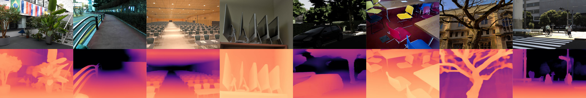

# **ZoeDepth: Combining relative and metric depth** (Official implementation)  <!-- omit in toc -->
[](https://colab.research.google.com/github/isl-org/ZoeDepth)
[](https://huggingface.co/spaces/shariqfarooq/ZoeDepth)

[](https://opensource.org/licenses/MIT)  
[](https://paperswithcode.com/sota/monocular-depth-estimation-on-nyu-depth-v2?p=zoedepth-zero-shot-transfer-by-combining)

>#### [ZoeDepth: Zero-shot Transfer by Combining Relative and Metric Depth](https://arxiv.org/abs/2302.12288)
> ##### [Shariq Farooq Bhat](https://shariqfarooq123.github.io), [Reiner Birkl](https://www.researchgate.net/profile/Reiner-Birkl), [Diana Wofk](https://dwofk.github.io/), [Peter Wonka](http://peterwonka.net/), [Matthias Müller](https://matthias.pw/)

[[Paper]](https://arxiv.org/abs/2302.12288)



## **Table of Contents** <!-- omit in toc -->
- [**Usage**](#usage)
  - [Using torch hub](#using-torch-hub)
  - [Using local copy](#using-local-copy)
    - [Using local torch hub](#using-local-torch-hub)
    - [or load the models manually](#or-load-the-models-manually)
  - [Using ZoeD models to predict depth](#using-zoed-models-to-predict-depth)
- [**Environment setup**](#environment-setup)
- [**Sanity checks** (Recommended)](#sanity-checks-recommended)
- [Model files](#model-files)
- [**Evaluation**](#evaluation)
  - [Evaluating offical models](#evaluating-offical-models)
  - [Evaluating local checkpoint](#evaluating-local-checkpoint)
- [**Training**](#training)
- [**Gradio demo**](#gradio-demo)
- [**Citation**](#citation)


## **Usage**
It is recommended to fetch the latest [MiDaS repo](https://github.com/isl-org/MiDaS) via torch hub before proceeding:
```python
import torch

torch.hub.help("intel-isl/MiDaS", "DPT_BEiT_L_384", force_reload=True)  # Triggers fresh download of MiDaS repo
```
### **ZoeDepth models** <!-- omit in toc -->
### Using torch hub
```python
import torch

repo = "isl-org/ZoeDepth"
# Zoe_N
model_zoe_n = torch.hub.load(repo, "ZoeD_N", pretrained=True)

# Zoe_K
model_zoe_k = torch.hub.load(repo, "ZoeD_K", pretrained=True)

# Zoe_NK
model_zoe_nk = torch.hub.load(repo, "ZoeD_NK", pretrained=True)
```
### Using local copy
Clone this repo:
```bash
git clone https://github.com/isl-org/ZoeDepth.git && cd ZoeDepth
```
#### Using local torch hub
You can use local source for torch hub to load the ZoeDepth models, for example: 
```python
import torch

# Zoe_N
model_zoe_n = torch.hub.load(".", "ZoeD_N", source="local", pretrained=True)
```

#### or load the models manually
```python
from zoedepth.models.builder import build_model
from zoedepth.utils.config import get_config

# ZoeD_N
conf = get_config("zoedepth", "infer")
model_zoe_n = build_model(conf)

# ZoeD_K
conf = get_config("zoedepth", "infer", config_version="kitti")
model_zoe_k = build_model(conf)

# ZoeD_NK
conf = get_config("zoedepth_nk", "infer")
model_zoe_nk = build_model(conf)
```

### Using ZoeD models to predict depth 
```python
##### sample prediction
DEVICE = "cuda" if torch.cuda.is_available() else "cpu"
zoe = model_zoe_n.to(DEVICE)


# Local file
from PIL import Image
image = Image.open("/path/to/image.jpg").convert("RGB")  # load
depth_numpy = zoe.infer_pil(image)  # as numpy

depth_pil = zoe.infer_pil(image, output_type="pil")  # as 16-bit PIL Image

depth_tensor = zoe.infer_pil(image, output_type="tensor")  # as torch tensor


# Tensor 
from zoedepth.utils.misc import pil_to_batched_tensor
X = pil_to_batched_tensor(image).to(DEVICE)
depth_tensor = zoe.infer(X)


# From URL
from zoedepth.utils.misc import get_image_from_url

# Example URL
URL = "https://encrypted-tbn0.gstatic.com/images?q=tbn:ANd9GcS4W8H_Nxk_rs3Vje_zj6mglPOH7bnPhQitBH8WkqjlqQVotdtDEG37BsnGofME3_u6lDk&usqp=CAU"


image = get_image_from_url(URL)  # fetch
depth = zoe.infer_pil(image)

# Save raw
from zoedepth.utils.misc import save_raw_16bit
fpath = "/path/to/output.png"
save_raw_16bit(depth, fpath)

# Colorize output
from zoedepth.utils.misc import colorize

colored = colorize(depth)

# save colored output
fpath_colored = "/path/to/output_colored.png"
Image.fromarray(colored).save(fpath_colored)
```

## **Environment setup**
The project depends on :
- [pytorch](https://pytorch.org/) (Main framework)
- [timm](https://timm.fast.ai/)  (Backbone helper for MiDaS)
- pillow, matplotlib, scipy, h5py, opencv (utilities)

Install environment using `environment.yml` : 

Using [mamba](https://github.com/mamba-org/mamba) (fastest):
```bash
mamba env create -n zoe --file environment.yml
mamba activate zoe
```
Using conda : 

```bash
conda env create -n zoe --file environment.yml
conda activate zoe
```

## **Sanity checks** (Recommended)
Check if models can be loaded: 
```bash
python sanity_hub.py
```
Try a demo prediction pipeline:
```bash
python sanity.py
```
This will save a file `pred.png` in the root folder, showing RGB and corresponding predicted depth side-by-side.
## Model files
Models are defined under `models/` folder, with `models/<model_name>_<version>.py` containing model definitions and  `models/config_<model_name>.json` containing configuration.

Single metric head models (Zoe_N and Zoe_K from the paper) have the common definition and are defined under `models/zoedepth` while as the multi-headed model (Zoe_NK) is defined under `models/zoedepth_nk`.
## **Evaluation**
Download the required dataset and change the `DATASETS_CONFIG` dictionary in `utils/config.py` accordingly. 
### Evaluating offical models
On NYU-Depth-v2 for example:

For ZoeD_N:
```bash
python evaluate.py -m zoedepth -d nyu
```

For ZoeD_NK:
```bash
python evaluate.py -m zoedepth_nk -d nyu
```

### Evaluating local checkpoint
```bash
python evaluate.py -m zoedepth --pretrained_resource="local::/path/to/local/ckpt.pt" -d nyu
```
Pretrained resources are prefixed with `url::` to indicate weights should be fetched from a url, or `local::` to indicate path is a local file. Refer to `models/model_io.py` for details. 

The dataset name should match the corresponding key in `utils.config.DATASETS_CONFIG` .

## **Training**
Download training datasets as per instructions given [here](https://github.com/cleinc/bts/tree/master/pytorch#nyu-depvh-v2). Then for training a single head model on NYU-Depth-v2 :
```bash
python train_mono.py -m zoedepth --pretrained_resource=""
```

For training the Zoe-NK model:
```bash
python train_mix.py -m zoedepth_nk --pretrained_resource=""
```
## **Gradio demo**
We provide a UI demo built using [gradio](https://gradio.app/). To get started, install UI requirements:
```bash
pip install -r ui/ui_requirements.txt
```
Then launch the gradio UI:
```bash
python -m ui.app
```

The UI is also hosted on HuggingFace🤗 [here](https://huggingface.co/spaces/shariqfarooq/ZoeDepth)
## **Citation**
```
@misc{https://doi.org/10.48550/arxiv.2302.12288,
  doi = {10.48550/ARXIV.2302.12288},
  
  url = {https://arxiv.org/abs/2302.12288},
  
  author = {Bhat, Shariq Farooq and Birkl, Reiner and Wofk, Diana and Wonka, Peter and Müller, Matthias},
  
  keywords = {Computer Vision and Pattern Recognition (cs.CV), FOS: Computer and information sciences, FOS: Computer and information sciences},
  
  title = {ZoeDepth: Zero-shot Transfer by Combining Relative and Metric Depth},
  
  publisher = {arXiv},
  
  year = {2023},
  
  copyright = {arXiv.org perpetual, non-exclusive license}
}

```


